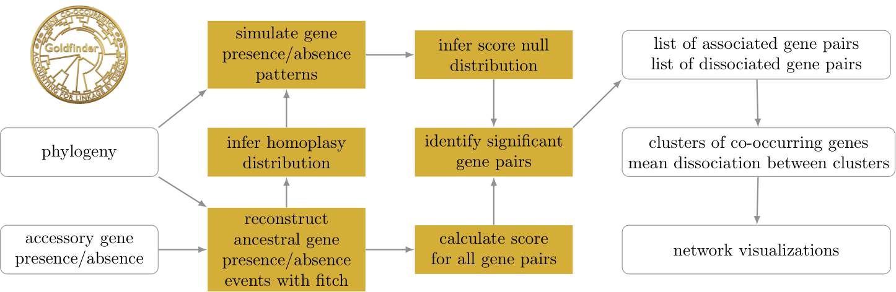

<p align="center">
  
</p>

<h1 align="center"> Goldfinder </h1>

<h3 align="center">A tool for identifying significant gene co-occurrances in
microbial strains while accounting for their
phylogenetic relationship</h3>

### What is it?
The genome of many prokaryotes is highly flexible. The total set of genes in
a bacterial population, the pan-genome, is therefore often significantly larger
than any individual genome from the population. While some essential genes
occur in all individuals, other genes occur only in a subset of the population. A
prominent example of such dispensable genes are genes that confer resistance
to antibiotic treatments. The evolutionary forces determining the presence and
absence of genes is thus of great interest. The composition of individual genomes
is by no means a combination of independently evolving genes. Prokaryotes are
not recombining their genomes as frequently as diploids. Consequently, their
clonal relationship, i.e the phylogenetic tree of the population, strongly affects
the likelihood of observed gene combinations. On the other hand, the selective
benefit or cost of genes within individual genomes depends on the presence of
other genes. For a metabolic pathway a complete set of genes is often necessary.
On the other hand, some genes might exclude each other such that only one
of the two genes can be present in any individual. We present the software
Goldfinder, a probabilistic approach that accounts for the dependencies created
by the clonal species tree of a microbial population. Goldfinder can be used
to find gene pairs that co-occur significantly more or less often than expected,
while accounting for the probability to co-occur due to the linked descent.

### Where can I read more about it?
If you add something here, also edit the help message of the tool. It can be done right at the top of main() in goldfinder.py.
Also edit the citation information section at the bottom of the readme.

### Installation

#### Conda
It is recommended to run Goldfinder in a virtual environment, as the numba package does not work with the latest python/numpy versions.

```
conda create --name goldfinder -c conda-forge python=3.11.6
conda activate goldfinder

git clone https://github.com/fbaumdicker/goldfinder.git
cd goldfinder
python -m pip install -r requirements.txt
```

##### Dependencies:
`Bio`==1.6.0 \
`DendroPy`==4.6.1 \
`ete3`==3.1.3 \
`markov_clustering`==0.0.6.dev0 \
`matplotlib`==3.8.1 \
`numba`==0.58.1 \
`numba_progress`==1.1.0 \
`numpy`==1.26.1 \
`pandas`==2.1.2 \
`scikit_bio`==0.5.9 \
`scikit_learn`==1.3.2 \
`scipy`==1.10.1 \
`six`==1.16.0 \
`statsmodels`==0.14.0 \
`tqdm`==4.66.1 \
`networkx`


# Methodology:
<p align="center">
  
</p>

Goldfinder simulates gene presence absence along a provided phylogeny and calculates the distribution of a score for all pairs of genes.
Based on this simulated null distribution, a p-value can be assigned to all observed gene presence absence patterns of co-occurring or avoiding gene pairs.


# How to run Goldfinder

`python goldfinder/goldfinder.py -i <path to gene presence/absence file> -t <path to phylogenetic tree file>`

`python goldfinder/goldfinder.py -i example_files/roary_mini_example.csv -t`

Goldfinder requires a gene presence/absence file as input, which can be provided in one of three formats: (a) as the `gene_presence_absence.csv` output from <a href="https://sanger-pathogens.github.io/Roary/">Roary</a> or <a href="https://github.com/gtonkinhill/panaroo">Panaroo</a>; (b) as a tab-delimited list of genes present in each strain; (c) as the output folder from <a href="https://pangenome.org/">PanX</a>. We have provided examplary files in these formats in the example_files folder.

You do not have to provide a phylogenetic tree, nevertheless the `-t` argument is required, as we would like to highlight that including one will improve analysis.

### Command line arguments

For more information on usage, please see `goldfinder -h`: 

```
File input:
  -i INPUT, --input INPUT
                        File containing gene presence/absence data, or panX folder
  -f [{roary,tab,panx}], --file_type [{roary,tab,panx}]
                        Clarifying which input file type Goldfinder is dealing with: a)
                        roary (or panaroo), b) tab, c) panx. (default: roary)
  -t [TREE], --tree [TREE]
                        User's phylogenetic tree in newick string format. Required, but
                        if given without argument, a phylogenetic tree is calculated from
                        the input table and used in further analysis. (default: None)
  -m METADATA, --metadata METADATA
                        Path to a tab-separated table containing metadata about the genes
                        (e.g. functional annotation, groupings, etc.). First column must
                        identify the gene (i.e. coincide with first col of input). The
                        metadata will be included in the results table and occur in the
                        visualization. If the format is roary or panaroo, columns 'Non-
                        unique Gene name' and 'Annotation' are used anyway.
File output:
  -o [OUTPUT], --output [OUTPUT]
                        Path to empty or non-existent folder where output files should be
                        stored (default: ./output)
  -O, --force_output    Set this in order to silence the warning about the output folder
                        existing and instead continue execution. Warning: Might lead to
                        problems and overwriting if files with the same name already
                        exist. (default: False)

Preprocessing:
  -prep, --preprocess   Genes present in less than 5% of sample are removed
  -tinf [{nj,ml}], --tree_inference [{nj,ml}]
                        Method with which a phylogenic tree will be inferred. Choices: nj
                        (Neighbor joining), ml (Maximum likelihood). (default: nj)

Simulation:
  -g [GENES_SIMULATED], --genes_simulated [GENES_SIMULATED]
                        integer specifying number of genes to be simulated for estimating
                        the null distribution. (default: 10000)
  -add ADDITIONAL, --additional ADDITIONAL
                        Percentile of scores for which addional fine-grained simulation
                        will be performed. Only relevant for simultaneous score.
                        (default: 0.9999)

Testing:
  -s [{terminal,simultaneous,subsequent,coinfinder}], --score [{terminal,simultaneous,subsequent,coinfinder}]
                        Type of score used for evaluating gene-gene
                        association/dissociation (default: simultaneous)
  -a [ALPHA], --alpha [ALPHA]
                        significance level (default: 0.05)
  -pcor [{bonferroni,fdr,none}], --pvalue_correction [{bonferroni,fdr,none}]
                        p-value correction method: bonferroni, false discovery rate, or
                        none (default: fdr)
  -k [KNOWN_ASSOCIATIONS], --known_associations [KNOWN_ASSOCIATIONS]
                        Number of surely occurring associations (or dissociations) or
                        path to a list in the format'Gene1\tGene2' of all surely
                        associated gene pairs. Number is inferred from the list and used
                        to improve multiple testing correction (Bonferroni and FDR). If a
                        list, the gene pairs will be marked in the output, even if the
                        corresponding p-value is not siginificant. (default: 0)

Clustering:
  -inf [INFLATION], --inflation [INFLATION]
                        Inflation affects granularity/resolution of clustering outcome
                        and needs to be >1 (default: 2.5)
  -n, --no_clustering   Set this if no clustering should be performed. (default: False)

Miscellaneous:
  -c [{association,dissociation,both}], --coocurrence [{association,dissociation,both}]
                       Whether to calculate associating or dissociating genes, or both.
                        If both and clustering is enabled, mean dissociation between
                        association clusters will be calculated and Cytoscape output
                        will be generated.(default: association)
  --seed [SEED]         An integer to be used as a random seed in order to make the
                        result reproducible.
```

# Output

#### `association_clusters.txt`
This file defines gene clusters as found by Markov clustering based on association scores. Each cluster starts with `>` followed by clulster ID and its size. In the following lines, all genes contained in the cluster are listed.

#### `{score}_{association/dissociation}_significant_pairs.txt`
This comma-separated file lists all gene pairs that are significantly associated/dissociated according to the chosen score. If appropriate, it also contains a `Cluster` column with the 1-based number of the cluster, or a `-` if the genes do not belong to the same cluster.

#### `cytoscape_input.csv`
This file is generated when `-c both` is used is clustering is not disabled. It is a comma-separated table listing all node pairs relevant for the visualization, their type of relationship and the associated force value used for the visualization layout. Possible types of relationship are: `gene-gene-assoc`, `gene-gene-dissoc`: Both nodes represent genes, and they are associated/dissociated respectively. `gene-cluster`: One node represents a cluster and the other a gene. This type is used to group genes of the same cluster. `cluster-cluster`: Both nodes represent clusters, this type is responsible for the layout of clusters .

Information on the other output files

## graphical visualization of the co-occurrence network and gene avoidance

Goldfinder outputs a number of files that can be visualized in the Cytoscape tool with the help of the py4cytoscape Python package, implemented in a jupyter notebook (.ipynb) file, which is provided. A local installation of Cytoscape (v3.10.0) or higher is required, as the network generation can only take place when Cytoscape is running. The user needs to specify the paths to the folders where the Goldfinder results can be found (input) and where files can be generated (output). Then, progressively following the instructions in the file, several kinds of visualizations can be produced. 

The most basic one (labelled 0) is focused on groups of associated genes that the MCL algorithm places in the same cluster and ignores the weaker associations that take place among these MCL clusters. Most of the remaining visualisations use this network as a base and add specific relationship edges to it.
Visualisations 1 and 1b are focused on disassociations between MCL clusters, ranking their significance based on two different metrics. The first one (1) is cluster-focused and is based on the fraction of disassociated genes between two MCL clusters. The second one (1b) is gene-focused and is calculated as follows. Considering two MCL clusters, each gene involved has the potential to be considered a "hit" if it is disassociated with at least 50\% of the genes in the other MCL cluster. These "hits" are then divided by the total number of genes in the two MCL clusters. This is the "GeneForce" that measures the significance of the disassociation between two MCL clusters, and is bound between 0 and 1. The respective disassociation draws edges wherever the value is above 0. These parameters can be manually changed.

Visualisation 2 is dedicated to highlighting associations that happen across MCL clusters and is based on the fraction of associated genes between two MCL clusters. Visualization 3 shows gene-gene associations that are happening across MCL clusters. The above mentioned options (1,2,3) can either create a network out of the most significant relationships or produce a collection of networks each showing a fraction of the possible edges, ordered by significance of the relationships, that includes the following: 1) MCL cluster-cluster disassociations, 2) MCL cluster-cluster associations, and 3) gene-gene among MCL cluster (weak) associations. The user can specify how many edges should be drawn in each network, which affects how memory-heavy the Cytoscape GUI becomes with this process.

The jupyter notebook also includes some additional visualizations only for completion purposes, as those were used to generate figures comparable to the COINfinder tool's output and are not suggested as explorative figures. 

# Citation information:

If you add something here, also edit the help message of the tool. It can be done right at the top of main() in goldfinder.py.

# Bugs and other issues:

In case you encounter problems with Goldfinder, please contact us or open an Issue on GitHub. It would be great if you could share the exact command you have used with the tool as well as provide us with a small dataset to narrow down the issue.
